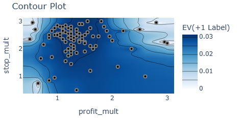
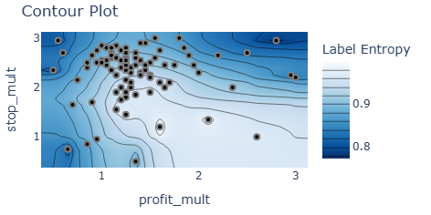
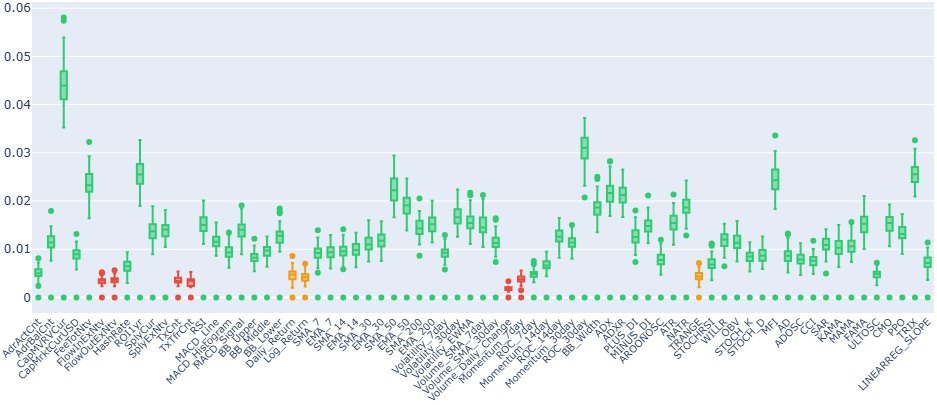
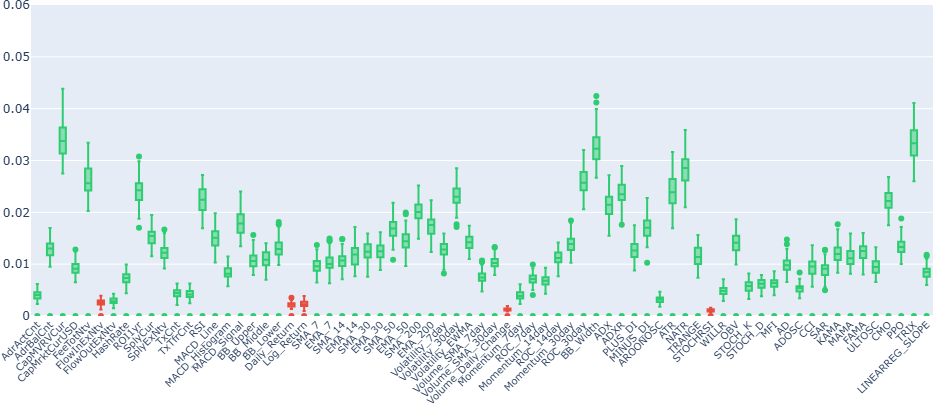
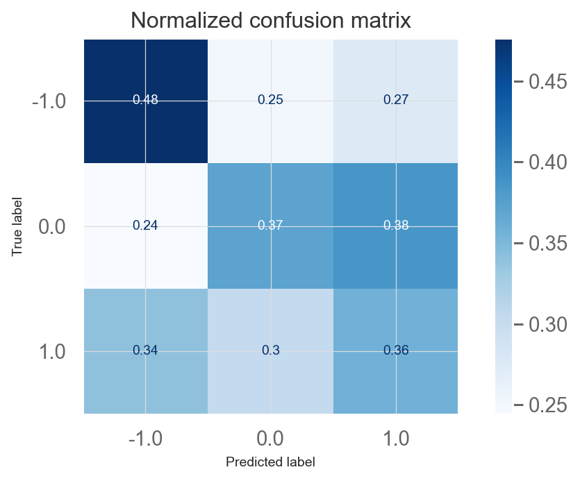
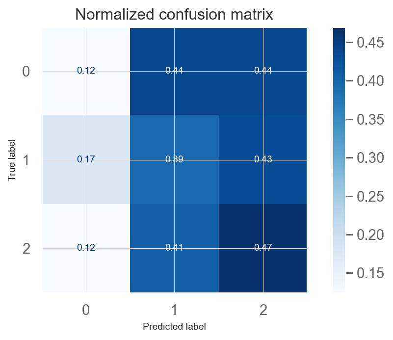

# ES327 · Bitcoin Risk Prediction via Triple-Barrier Labelling

Supervised classification pipeline that labels daily Bitcoin observations as
favourable (+1), neutral (0), or adverse (−1) using López de Prado's
volatility-scaled triple-barrier method. Four classifiers (LR, SVM-RBF, RF,
XGBoost) are trained and evaluated across two Bayesian-optimised label
configurations on a 69-feature dataset spanning 2014–2026.
Noteworthy Result: SVC (Max EV) · Sharpe 2.051 vs. buy-and-hold 1.419 · test set 2022–2026
---

## Why this approach?

Fixed-horizon binary labels ignore intra-period price paths, force a trade
every day, and use static thresholds blind to volatility. Triple Barrier
encodes *which* barrier is hit first — profit target, stop-loss, or time
expiry — with both barriers scaled to EWMA volatility, directly encoding
asymmetric payoff structure into the training label. Three classes are used
so the model can abstain (0) rather than forcing a directional signal on
ambiguous days. Boruta is used for feature selection because its
shadow-feature test gives formal confirmation of relevance rather than a
ranked list, and is model-aware unlike filter methods. A 7-day embargo is
applied between CV folds to prevent the triple-barrier forward window of the
last training label from overlapping with validation data.
For full methodology justification see the dissertation.

---

## Pipeline
01 · Data Download yfinance OHLCV + CoinMetrics on-chain + Fear & Greed Index
02 · Feature Engineering TA-Lib indicators → 69-feature candidate set
03 · Label Parameter Search Optuna TPE · 150 trials · dual objectives (EV + entropy)
04 · Data Label & Split src/triple_barrier.py · 80/20 chronological split
05 · Feature Selection Boruta · 100 trials · scikit-learn Random Forest
06 · Hyperparameter Tuning Optuna TPE · TimeSeriesSplit + 7-day embargo
07 · Model Training LR · SVM-RBF · RF · XGBoost · baselines → MLflow
08 · Model Evaluation ML metrics · trade metrics · SHAP · QuantStats tearsheets

Each stage reads from and writes to `data_cache/*.pkl`. All experiments are
logged to MLflow with params, metrics, and artefacts per run.

| Source | Content | Period |
|---|---|---|
| Yahoo Finance (`yfinance`) | BTC-USD OHLCV daily | 2014–2026 |
| CoinMetrics (community API) | 31 on-chain metrics | 2009–2026 |
| alternative.me | Fear & Greed Index | 2018–2026 (excluded by default\*) |

\* FGI is excluded from the default run — its 2018 start truncates four years
of training data. Enable it in `01_data_download.ipynb`.

---

## Label Configurations

Two Optuna runs with different objectives produce two named label sets,
propagated independently through all downstream stages.

<p align="center">
  
  
</p>
<p align="center"><em>Left: EV of the +1 label. Right: Label entropy.
The two objectives peak in different regions — the core design tension.</em></p>

| | Max EV | Balanced Entropy |
|---|---|---|
| `profit_mult` | 1.25 | 1.6 |
| `stop_mult` | 2.8 | 1.2 |
| EV of +1 label | 0.0314 | 0.0298 |
| Label entropy | 0.8921 | 0.9988 |
| Train dist. (−1 / 0 / +1) | 12% / 44% / 44% | 34% / 31% / 35% |

---

## Feature Selection

<p align="center">
  
</p>
<p align="center">
  
</p>
<p align="center"><em>Boruta importances across 100 trials.
Green = confirmed · Red = rejected · Orange = tentative.</em></p>

**Confirmed in both configs:** `AdrActCnt`, `CapMVRVCur`, `CapMrktCurUSD`,
`ROC_30day`, `ROC_14day`, `Momentum_14day`, `ATR`, `BB_Width`, `NATR`

**Rejected in both configs:** `DailyReturn`, `LogReturn`, most short-window
SMAs/EMAs — consistent with weak-form EMH at daily frequency

**Confirmed under Balanced only:** `TxCnt`, `TxTfrCnt`, `FlowOutExNtv`,
`TRANGE`, `Momentum_7day` — signal concentrated in the −1 class, too sparse
under Max EV (~12%) for MDI to clear the shadow threshold

---

## Results

All Balanced Entropy models and LR/RF under Max EV collapsed to predicting
−1 for ≥80% of test observations and are omitted. Only SVC and XGBoost
under Max EV produced non-degenerate outputs.

### SVC · Max EV

<p align="center">
  
</p>

Diagonal values 0.48 / 0.37 / 0.36 — the only model with meaningful
three-class discrimination across the full experiment set.

| Metric | Train | Test | Buy-and-hold |
|---|---|---|---|
| F1 Macro | 0.451 | 0.374 | — |
| MCC | 0.184 | 0.070 | — |
| ROC-AUC OVO | 0.609 | 0.552 | — |
| Sharpe ratio | — | **2.051** | 1.419 |
| Sortino ratio | — | **3.118** | 2.235 |
| Calmar ratio | — | 1.777 | — |

The dissociation between near-chance F1 and above-benchmark Sharpe is
structural: a model that conservatively predicts +1 only on strong signals
trades infrequently but avoids compounding losses on ambiguous days.

### XGBoost · Max EV

<p align="center">
  
</p>

Inverts the degenerate pattern: distributes 82–88% of predictions across 0
and +1, virtually never predicting −1. Under Max EV, the stop-loss class is
only ~12% of training data — sequential boosting learns to ignore it
entirely. Train MCC 0.267 → test MCC 0.031 points at overfitting.

| Metric | Train | Test |
|---|---|---|
| F1 Macro | 0.483 | 0.243 |
| MCC | 0.267 | 0.031 |
| Sharpe ratio | — | 1.103 |
| Sortino ratio | — | 1.847 |

---

## Limitations & Future Work

- **One-sided EV objective** — Max EV search optimises the +1 label only; a signed EV incorporating −1 quality would better align labelling with trade evaluation
- **Short signals unused** — `calculate_trade_metrics.py` only enters long trades (`y_pred == +1`); the −1 label is never evaluated as a trading signal
- **Fixed holding period** — 7-day window is unjustified empirically; sensitivity analysis across 3, 7, 14, 21 days remains open
- **Regime conditioning** — label quality varies by market regime; separate models per detected regime would address the non-stationarity driving near-chance test performance

---

## Setup

```bash
git clone https://github.com/harneetsbaweja/ES327-bitcoin-risk-model.git
cd ES327-bitcoin-risk-model
pip install -r requirements.txt
```

Run notebooks in order (`01` → `08`). Each stage writes a `.pkl` artefact
to `data_cache/` consumed by the next stage. MLflow experiments are stored
locally in `mlruns/`.

| Package | Role |
|---|---|
| `yfinance` | OHLCV data download |
| `ta-lib` | Technical indicator computation |
| `boruta` | Feature selection |
| `optuna` | Bayesian hyperparameter search |
| `scikit-learn` | Models, CV, scaling, metrics |
| `xgboost` | Gradient boosted classifier |
| `mlflow` | Experiment tracking |
| `quantstats` | Trading tearsheets |
| `shap` | Feature attribution |
